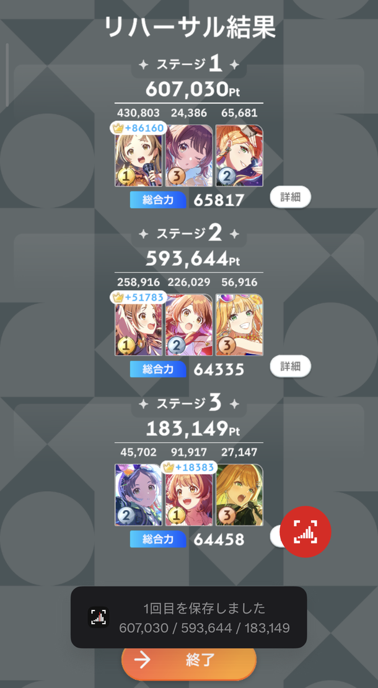
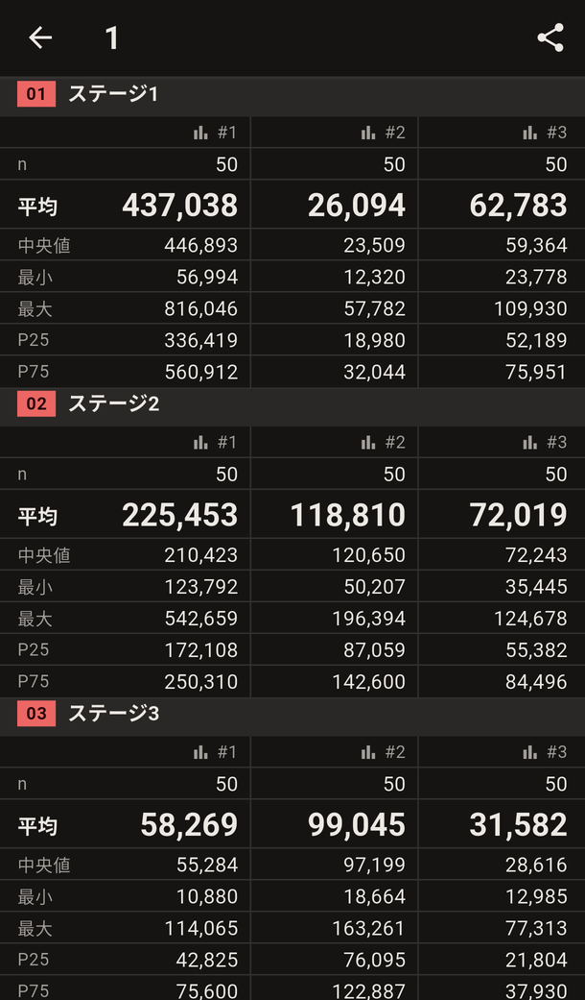
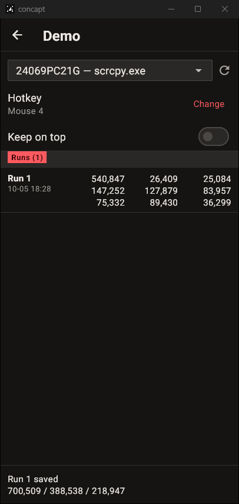

# concapt

[English](README.md) | 日本語

concapt は、学園アイドルマスターのコンテストのリハーサル結果を統計にするアプリです。Android ではフローティングバブルをタップ、Windows ではホットキーを押すだけで、メンバー9人のスコアを読み取り、ゲーム側の合計と照合して、セッションに記録します。セッションごとに、スロット別の統計、ヒストグラム、CSV 書き出しを利用できます。

| キャプチャ用バブル | セッション | Windows |
|---|---|---|
|  |  |  |

## できること

- **ワンタップでキャプチャ。** バブルはゲームの上に表示され、キャプチャには写り込みません。
- **スコアを検証。** 各ステージのメンバー3人のスコアと王冠ボーナス（最高スコアの5分の1）の和が、ステージ合計と一致する必要があります。一致した記録は自動で保存され、一致しない記録は結果画面を表示したまま編集パネルで直せます。
- **スロット別の統計。** ステージ × スロットの9系列それぞれに、n・平均・中央値・最小・最大・P25・P75 とヒストグラムを表示します。
- **CSV 書き出し。** 表計算ソフトでの分析や共有に使えます。
- **日本語と英語** の UI、ライトテーマとダークテーマに対応しています。

## インストール

[Releases][releases] から最新版をダウンロードしてください。

| プラットフォーム | ファイル | 動作環境 |
|---|---|---|
| Android | `concapt-<version>.apk` | Android 8.0 以降 |
| Windows | `concapt-<version>-windows-x64.zip` | Windows 10 バージョン 2004 以降 |

- **Android：** APK を開き、確認が出たらそのアプリからのインストールを許可してください。
- **Windows：** 任意の場所に展開し、`concapt.exe` を実行してください。コード署名がないため、初回起動時に SmartScreen の警告が出ます。「詳細情報」→「実行」を選んでください。

## 使い方

### Android

1. リハーサルするチームごとにセッションを作成します。
2. **キャプチャ開始** をタップし、通知と「他のアプリの上に重ねて表示」を許可します。
3. 共有方法を聞かれたら **画面全体** を選びます。バブルが表示され、concapt は最小化されます。
4. ゲームでリハーサル結果を開き、バブルをタップします。保存されるとトーストで知らせます。
5. concapt に戻り、スロットの列をタップするとヒストグラムを表示します。CSV でも書き出せます。

### Windows

1. セッションを作成し、**キャプチャ開始** をタップします。
2. ゲームのウィンドウ、またはスマホを映した [scrcpy](https://github.com/Genymobile/scrcpy) のウィンドウを選びます。
3. 結果画面で **F9** を押します。ホットキーは別のキー、キーの組み合わせ、マウスのサイドボタンに変更できます。

concapt は選んだウィンドウを直接キャプチャするため、ゲームの上に重ねて置いても問題ありません。**常に手前に表示** をオンにすると、手前に表示し続けます。

## プライバシー

- 文字認識は端末上で行います。キャプチャやセッションが端末の外に出ることはありません。
- セッションはローカルの SQLite データベースに保存されます。データを外に出す手段は CSV 書き出しだけです。
- Android 版には Google ML Kit が含まれており、インターネット接続の権限を宣言しています。匿名の利用統計が Google に送信される場合があります。Windows 版は Windows 標準の文字認識を使います。

## 制限事項と FAQ

- **自動操作はしません。** リハーサルを自動で進めたり、結果画面を自動で検出したりはしません。キャプチャは毎回手動です。
- **1セッション1チーム。** 各スロットには、すべての記録で同じキャラクターが入っている必要があります。チームを変えたら新しいセッションを作成してください。
- **重複。** 同じ結果を2回キャプチャすると、2回目はスキップされます。
- **Windows の文字認識には英語が必要です。** 文字認識がないと表示された場合は、設定 › 時刻と言語 › 言語と地域 で英語を追加してください。
- **Android のトーストは少なめです。** バックグラウンドのアプリのトーストは20秒に3回程度に制限されるため、連続でキャプチャすると通知なしで保存されることがあります。
- **iOS** には現在対応していません。

## ソースからビルド

Flutter 3.41.4 が必要です。Windows 版のビルドには、C++ によるデスクトップ開発ワークロードを入れた Visual Studio 2022 が必要です。

```sh
flutter pub get
flutter test
flutter run -d <android-device-id>
flutter run -d windows
```

リリースビルドの署名とパッケージ化は `docs/releasing.md`（英語）を参照してください。

## ドキュメント（英語）

| ファイル | 内容 |
|---|---|
| `PRODUCT.md` | ユーザー、用語、ブランド |
| `DESIGN.md` | デザインシステム |
| `docs/superpowers/specs/` | Android 版と Windows 版の設計仕様 |
| `docs/manual-test-checklist.md` | 実機での確認項目 |
| `docs/releasing.md` | リリースビルド |

## ライセンス

MIT ライセンスです。`LICENSE` を参照してください。同梱の Roboto フォントは SIL Open Font License で提供されています（`assets/fonts/OFL.txt`）。

学園アイドルマスターは株式会社バンダイナムコエンターテインメントの商標です。concapt は非公式のファンプロジェクトであり、バンダイナムコとは一切関係ありません。

[releases]: https://github.com/uzukisanzu/concapt/releases
