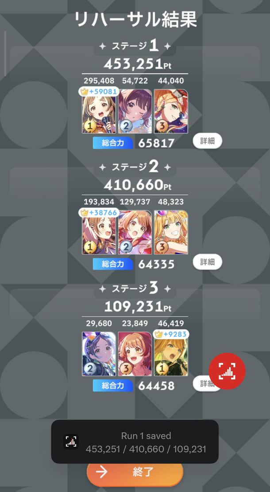
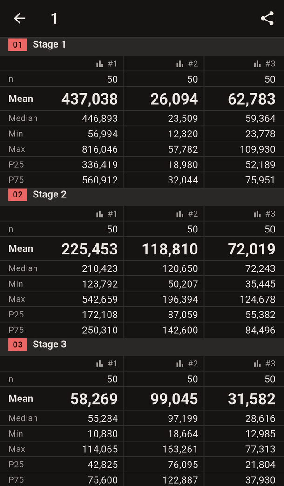

# concapt

English | [日本語](README.ja.md)

concapt turns Gakuen Idolmaster contest rehearsal results into statistics. Tap a floating bubble on Android, or press a hotkey on Windows, and concapt reads the nine member scores, checks them against the game's own totals, and adds the run to a session. Each session shows per-slot statistics, histograms, and CSV export.

| Capture bubble | Session | Windows |
|---|---|---|
|  |  |  |

## What it does

- **One-tap capture.** The bubble sits over the game and never shows up in its own capture.
- **Verified scores.** Each stage's three member scores plus the crown bonus (a fifth of the top score) must equal the stage total. Runs that pass save on their own; runs that fail open an edit panel while the result is still on screen.
- **Statistics per slot.** n, mean, median, min, max, P25, and P75, plus a histogram for each of the nine stage × slot series.
- **CSV export** for spreadsheets or sharing.
- **English and Japanese** UI, light and dark themes.

## Install

Download the latest build from [Releases][releases].

| Platform | File | Requires |
|---|---|---|
| Android | `concapt-<version>.apk` | Android 8.0 or later |
| Windows | `concapt-<version>-windows-x64.zip` | Windows 10 version 2004 or later |

- **Android:** open the APK and allow installs from that source when asked.
- **Windows:** unzip anywhere and run `concapt.exe`. The build isn't code-signed, so SmartScreen warns on first run. Choose "More info", then "Run anyway".

## Usage

### Android

1. Create a session for the team you're rehearsing.
2. Tap **Start capturing**. Allow notifications, then "Display over other apps".
3. When Android asks what to share, choose **Entire screen**. The bubble appears and concapt minimizes.
4. In the game, open a rehearsal result and tap the bubble. A toast confirms the saved run.
5. Back in concapt, tap a slot column to see its histogram, or export the session as CSV.

### Windows

1. Create a session and tap **Start capturing**.
2. Pick the game window, or a [scrcpy](https://github.com/Genymobile/scrcpy) window mirroring your phone.
3. On a result screen, press **F9**. Change the hotkey to another key, a key combination, or a mouse side button.

concapt captures the picked window directly, so it can sit on top of the game. Turn on **Keep on top** to keep it there.

## Privacy

- OCR runs on your device. Captures and sessions never leave it.
- Sessions live in a local SQLite database, and CSV export is the only way data goes out.
- The Android build includes Google ML Kit, which declares internet access and may send Google anonymous usage metrics. The Windows build uses Windows' built-in OCR.

## Limitations and FAQ

- **No automation.** concapt doesn't tap through rehearsals or detect result screens by itself. You trigger each capture.
- **One team per session.** Each slot must hold the same character in every run. Start a new session when the team changes.
- **Duplicates.** Capturing the same result twice skips the second run.
- **Windows OCR needs English.** If concapt says text recognition is missing, add English under Settings › Time & language › Language & region.
- **Android shows few toasts.** Android limits toasts from background apps to about three per 20 seconds, so fast captures may save silently.
- **No iOS** for now.

## Build from source

Requires Flutter 3.41.4. Windows builds need Visual Studio 2022 with the C++ desktop workload.

```sh
flutter pub get
flutter test
flutter run -d <android-device-id>
flutter run -d windows
```

`docs/releasing.md` covers signing and packaging the release builds.

## Docs

| File | Contents |
|---|---|
| `PRODUCT.md` | Users, terminology, brand |
| `DESIGN.md` | Design system |
| `docs/superpowers/specs/` | Android and Windows design specs |
| `docs/manual-test-checklist.md` | On-device checks |
| `docs/releasing.md` | Release builds |

## License

MIT, see `LICENSE`. The bundled Roboto fonts are under the SIL Open Font License (`assets/fonts/OFL.txt`).

Gakuen Idolmaster is a trademark of Bandai Namco Entertainment. concapt is an unofficial fan project and isn't affiliated with or endorsed by Bandai Namco.

[releases]: https://github.com/uzukisanzu/concapt/releases
